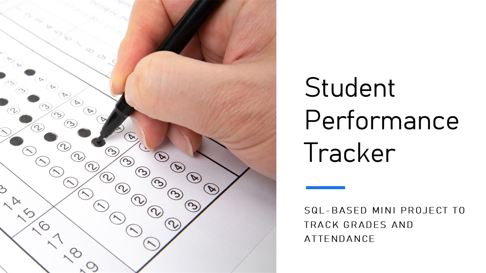

# 🎓 Student Performance Tracker (SQL Mini Project)

A mini database project to manage and analyze student academic performance and attendance.

## 📁 Project Structure

- `schema/` → SQL schema to create database tables
- `data/` → Sample SQL data insertions
- `queries/` → Sample SQL analysis queries

## 🚀 How to Use

1. Set up a local or cloud SQL database (PostgreSQL or MySQL).
2. Run `schema/create_tables.sql` to create tables.
3. Run `data/sample_data.sql` to insert sample records.
4. Run `queries/analysis_queries.sql` to analyze performance.

## 🔍 Features

- Track marks and attendance per course
- Analyze top-performing students
- Correlate attendance with grades

---

🎯 Ideal for database practice and interviews.
